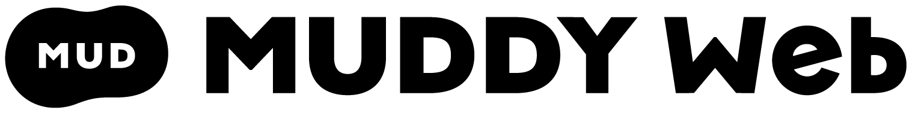

## Muddy Web とは？

Muddy Web は株式会社サイバーエージェントが主催する Web フロントエンドエンジニアの技術共有チャンネルです。

Muddy = 泥臭いとして、Webフロントエンドの開発現場における話やケーススタディなど泥臭さのある話をもとに学びを得ることを目的として開催しています。

サイバーエージェントの開発現場で遭遇した具体的な体験を元に、実際に明日から使えるかもしれないWebフロントエンド的な技術や知識を参加者の皆さまと共有し合うことを通して、フロントエンド開発の糧になれればと思います。

現在はセッション形式の Meetup と音声のみの Podcast の二軸で活動しています。ハッシュタグは共通で [#muddy_web](https://twitter.com/search?q=%23muddy_web&src=typed_query&f=live) です。

## Meetup

セッションを主軸にした勉強会形式のイベントです。YouTube を使ってオンライン配信をしています。

過去・未来のイベント情報は [connpass](https://connpass.com/search/?q=Muddy+Web) からご覧いただけます。

また、過去の発表はセッションごとの切り出し動画を [YouTube の CyberAgent Developers チャンネル](https://www.youtube.com/playlist?list=PLBsO-IAhmMUU-wG85J87HB4p7KNB034M-) で視聴いただけます。

## Podcast

隔週で各媒体にて配信される Podcast です。[Whisper](https://github.com/openai/whisper) を使った書き起こしを本レポジトリで配布しています。

https://anchor.fm/muddy-web
